# Sessions 01 and 02

## Designing and Building Lasercut Prototype Enclosures in Rhino

This is a practical guide with limited scope to building enclosures/interface boxes, please also undertake the [Rhino Essential Training](https://www.lynda.com/Rhino-tutorials/Rhino-5-Essential-Training/133324-2.html) Lynda course.

### Task 1 - Research

### Task 2 - Simple 2D Drawing

#### Interface

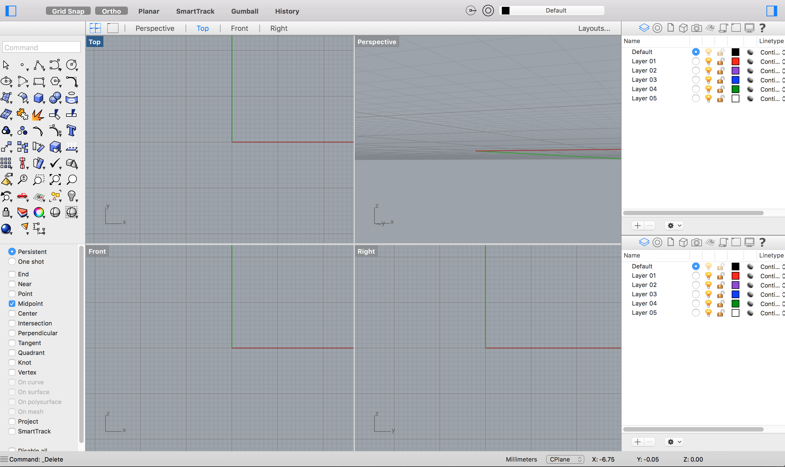

Make new Large Objects mm template.

Command line

OSnap

Ortho

Grid Snap

View on panes

#### Line

Type the word "Line", you will see that in the command line, it will start to guess what you want.

Hit Enter when the word "Line" is highlighted in the command line.

In the pane labelled "Top" click on coordinate point 0,0,0. This is the first point of our line.

Now click 20mm above the first point.

If you make a mistake when clicking, just hit escape or click cancel and start again. 

You've drawn your first line!

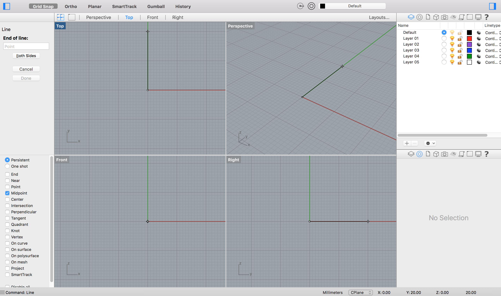

OK, now experiment with the "move" command to try moving the line around. What happens if you turn on Ortho (you also have to find it on the interface again!).

##### Options

When you select a particular drawing method, you will be given a set of options. If you're working on a PC these options are selectable using letter keys on the keyboard, these keys are highlighted in the words of the options beneath the command line:

On a mac, there are also buttons to select the options:

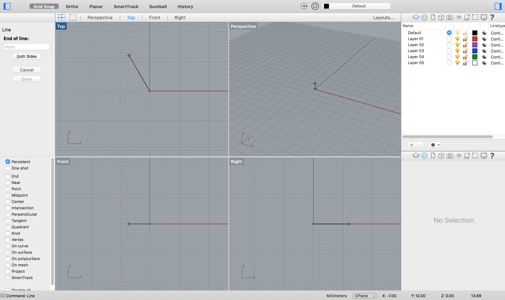

You can see that we can draw from the centre, and the PC loads of other options are available.

#### Polyline

Now type the word "Polyline". 

Try experimenting with it, what does Polyline mean, based on what happens when you click around in the top pane?

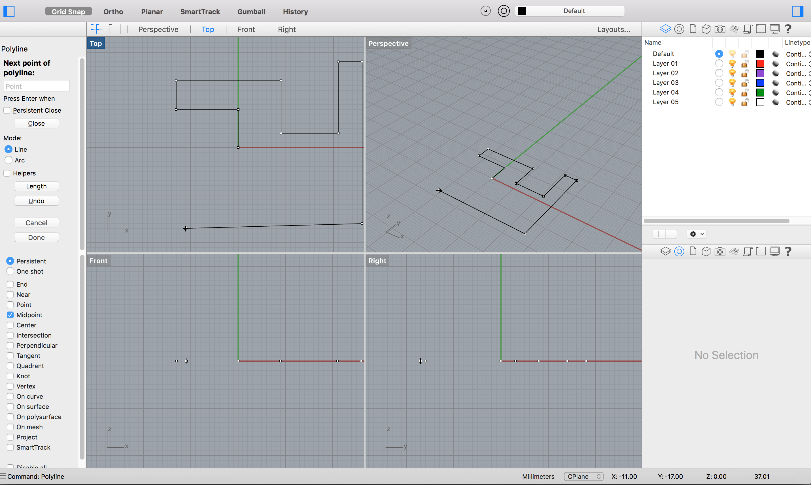

#### Curves

OK, that's all good for straight lines, but what happens if we want a curved line. Try clicking on the curve menu at the top. There are lots of options here, all quite useful but perhaps a bit daunting. Click off the menu and try typing "_curve" into the command line. This will allow us to create a bezier curve through the points we click on the plane. Ensure you are focused in the top view pane again...

Just click around and experiment, can you undo if you made a mistake?

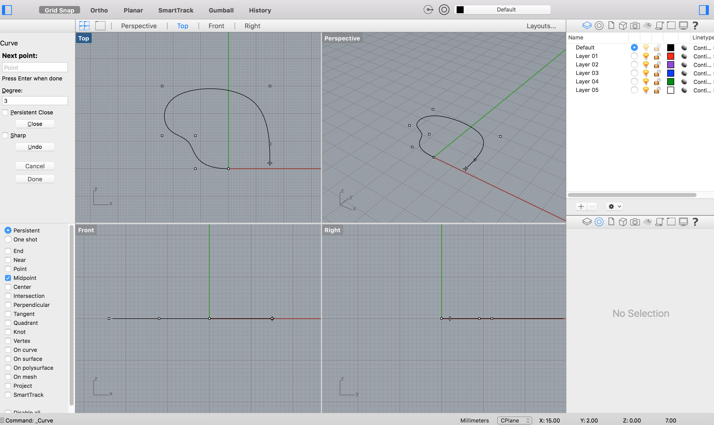

### Task 3 - Extrusion

Extrusion is a process used a lot in CAD and general manufacturing, and it's something we're going to be using a lot whilst we lasercut stuff. It involves creating an object that has a cross-sectional profile that is fixed.

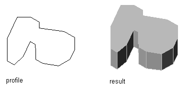

#### Rectangle

With the top pane focused, type "rect" and the command line will auto-fill to "Rectangle". Hit enter. In the options, you will be able to select "center", go ahead. 

Click on point 0,0,0 and draw a rectangle that is 30mm wide and 80mm high. HINT: you can type those figures in if you want...

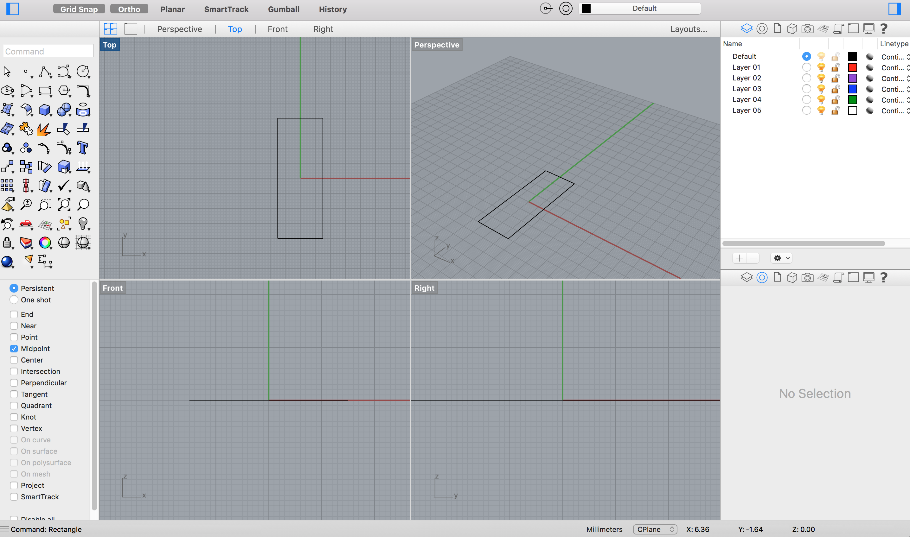

Now type "extrude" into the command line. 

You can see that you are presented with some options here. We want to make a solid object, so type the letter that makes it *S*olid...

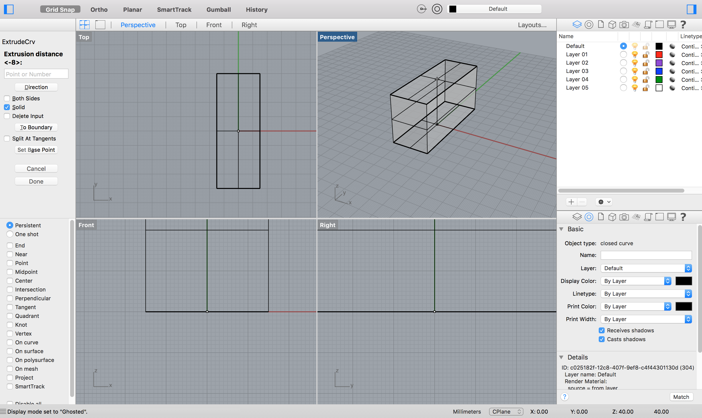

Great, we created a box! Handily, there is also a "Box" command. But the principle of extrusion is really important to understand...  

#### Circle

Let's do the same with a circle:

Create a circle with a diameter of 100mm.

Then extrude it as a solid cylinder that is 500mm long.

#### Polyline

OK now draw polyline in a shape of your choosing. Make sure that the start and end points are the same so you create what is called a closed curve. Use OSnap End to your advantage.

Now extrude and make your custome shape.

### Task 4 - Split/Boolean Split

The "Split" function is another incredibly useful tool in our inventory. It uses one object to cut another. Let's try it with two lines:

#### Lines

Draw one line 10mm long. Then, use OSnap to snap to the midpoint of this line and draw another line which intersects it halfway along at a right angle.

Click on the first line and type "Split". Now click on the second line and hit enter.

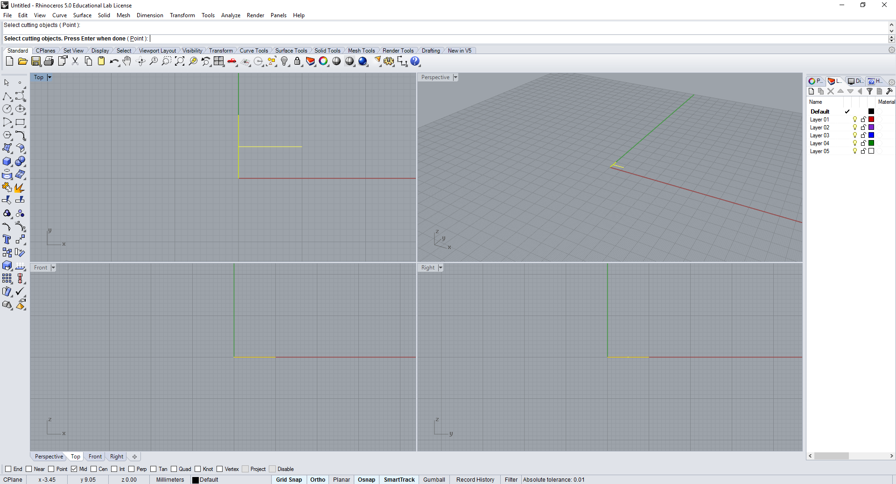

Now you have three lines!

#### Cylinder

Create a cylinder by typing the word "Cylinder" into the command line. Make a cylinder that is 80mm diameter and 200mm long.

#### Box

Now make a box that starts on the midpoint of one side of the cylinder. Use Osnap to your advantage here. 

OK, type the command "Boolean Split" into the command line and hit enter. When prompted for the object to split, select the cylinder and hit enter. When prompted for cutting object, select the box and hit enter.

Now delete the box and you should see that you have split the cylinder into a custom shape.

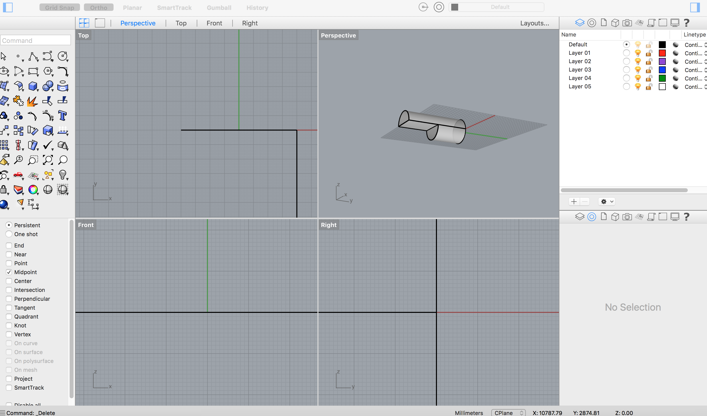

#### Sphere

Now try the same thing but using the sphere command. Make sure it intersects with the end of the custom cylinder. Using "OSnap center" to your advantage so that it snaps to the right point.

Now do boolean split in an order of your choosing - will you split the cylinder or the sphere?

I split the sphere and deleted the cylinder:

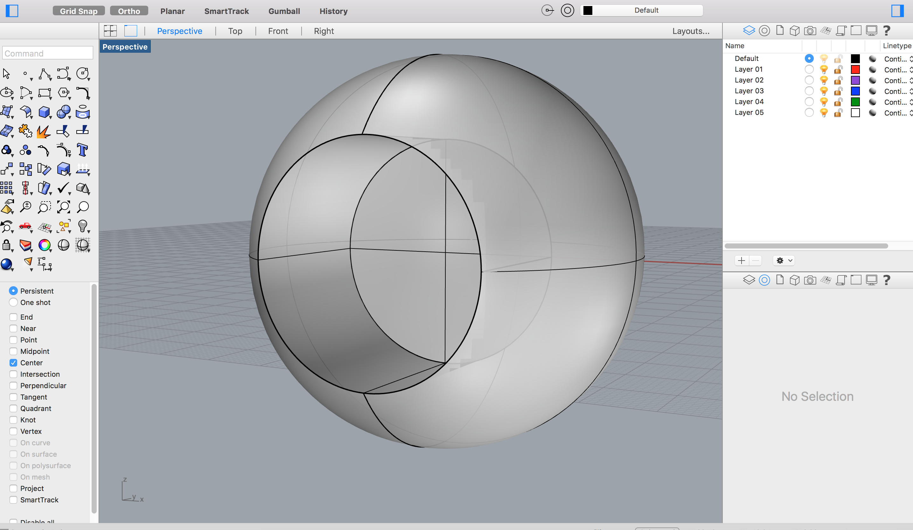

### INTERLUDE 1 - MATERIAL THICKNESS

When creating designs for lasercutting, it is critical that we know the thickness of the sheet material we are cutting. 

For this project, we will cut a 5mm plywood. That is pretty thick, but at least we will know it is strong. 

### INTERLUDE 2 - ARDUINO MODEL

So, we now know how thick the walls of our box will be, but how do we know how big to make the box?

This is where the power of the interplex comes into play for us: someone somewhere will have thought of this already, and will have made a 3D model of an Arduino board.

Some cursory research resulted in me finding this: [Arduino 3D model](https://grabcad.com/library/arduino-uno-r3-1). You'll need to register an account to download it. Make sure you put it in the same directory where your Rhino project is located. Because you've definitely saved already, right? That would be crazy to start working on a new project and save your work...

OK, now go to file->import and import the file called "arduino uno.STEP". Select the default import settings et voila, we have our very own Arduino Uno sitting in space. 

You have to figure this one out: you need to *rotate* the Arduino by 90 degrees so it lies flat on the Y Plane. HINT: Use Ortho to your advantage. Take Osnap off and rotate around point 0,0,0.

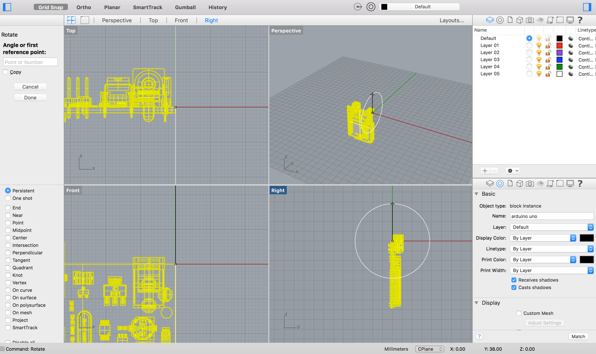

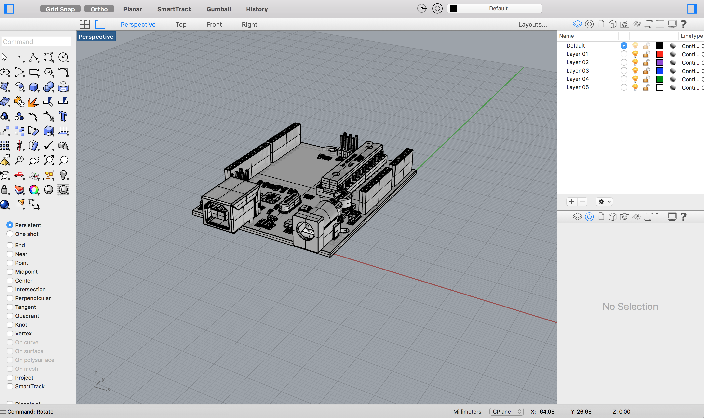

Now put Osnap on End, and type the command "move". Hover your cursor over the very bottom of the pins on the underside of the board in the Front view pane. Let the cursor snap to the bottom of the pin. Now move the board up so it sits about 5mm above the X axis.

### Task 5 - Using Layers

As with Adobe products, Rhino (as other CAD programmes) implements a system of layers. Layers are incredibly useful when working with more complex designs, as it means you can logically group objects and turn visibility on and off to aid understanding.

The layers pane is located to the right hand side. The lightbulb symbol is for visibility. You can also lock the layer to prevent changes.

As you can see when we made our new project from the template, we automatically had 6 layers created for us. By double clicking on the name, you can edit it. Let's change the first three layers to have the names "Front_Back", "Left_Right" and "Top_Bottom".

Let's also put the Arduino on it's own layer. Rename one of the other layers. Then click on the Arduino so it is selected, then right click on your Arduino layer in the Layers pane and select "Move Objects to Layer" or "Change Object Layer", depending on which version you're using.

#### First side of box - Top and Bottom

Maximise the top view by double clicking in the top left hand corner, where it says "Top".

Select the Top_Bottom layer in the Layers pane by clicking the corresponding radio button.

Now draw a rectangle (120mm x 160mm) whose bottom side is level with the USB port of the Arduino, this will help us to see the total area of our box:

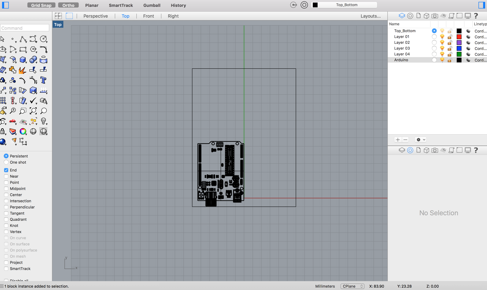

Make sure you leave more than 5mm space on the left hand side of the Arduino...

Do the following whilst still in the Top_Bottom layer:

We're now going to make the outline for five finger joints at the bottom of our box. In order to do this, we need to calculate how many times five goes into the full width of 120mm.

Once you've calculated that number draw a polyline that starts snapped to the top left hand corner of the rectangle. Each horizontal segment of the polyline should be the length of the number that you calculated, and each vertical segment should be 5mm long:

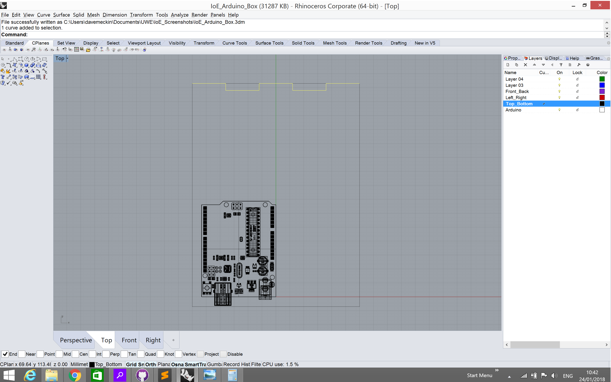

##### Using the mirror function

Now, rather than having to do all that again, we're able to use the "mirror" function to replicate our polyline. With the line selected, type "mirror", and make sure you select the copy option as we want to make a copy. Now, with Osnap on midpoint, hover your cursor over the middle of one of the longer lines of the rectangle. You'll see that your polyline is replicated on the bottom edge of the rectangle. Hit enter.

Now we're going to repeat the process for the long sides. Let's divide 160 by 7 this time, you can round the result down to 2 decimal places. Now make a polyline going from the top left hand corner down to the bottom left hand corner with the vertical segments at the division you calclulated. And the horizontal segments at 5mm. Remember to use OSnap end...

Now let's mirror it snapping to the midpoint of the bottom line of the rectangle.

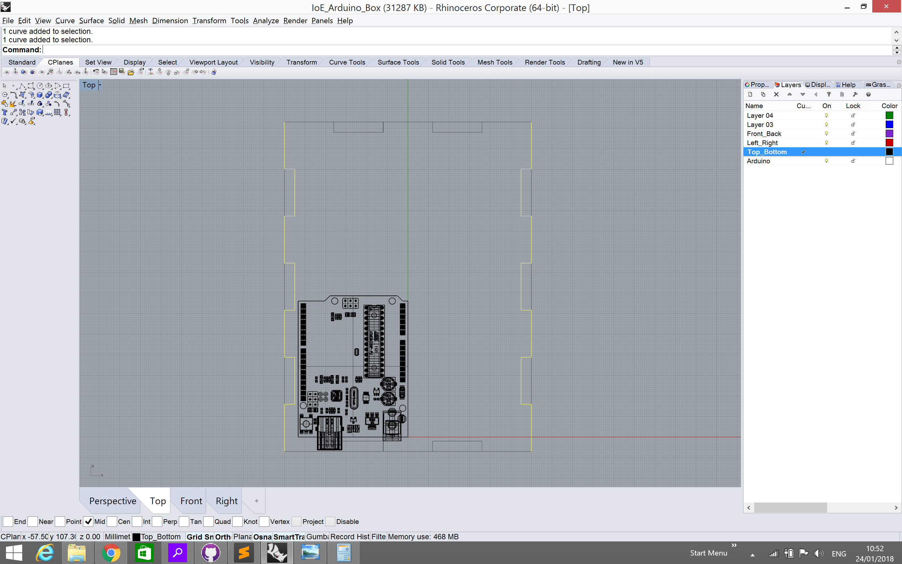

Alrighty, we now have the outline of the bottom of our box. So here we encounter another one of our common commands: "join". Select all four polylines you've drawn and type "join". You should see Rhino say "4 curves joined into one closed curve." in the command line. If you don't see that, your curves aren't snapped properly, so you'll have to find the point where their not touching each other and redraw it.

Now for our extrusion, go back into viewing all four view panes by double clicking in the top left hand corner again. Now, whilst focused in the "right" pane with the joined polyline selected, type "extrude" and select "extrudecrv". 

Extrude upwards by 5mm. There, now we have our bottom piece of plywood for our box!

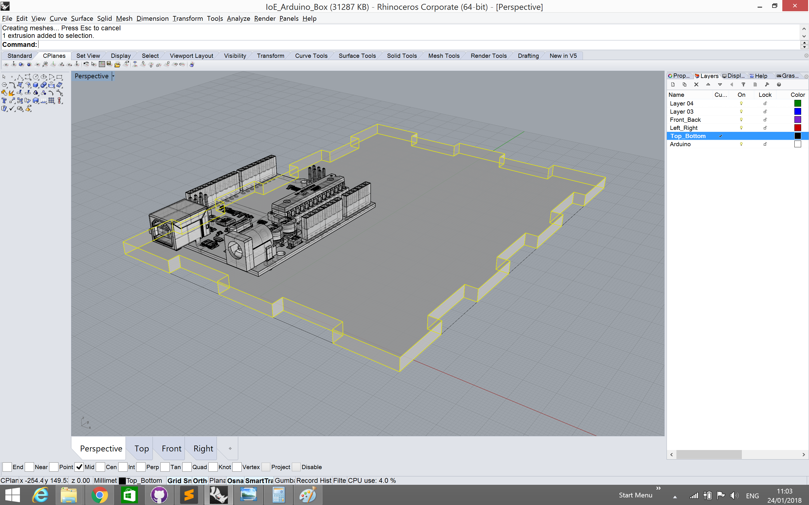

OK now create a new layer called "Const_lines_01" and move your intitial rectangle line, and your polyline to that layer.

#### Second side of box

With the right hand view pane maximised, create a rectangle that starts (end snapped) from the bottom left hand corner of the bottom extrusion. The rectangle should be 160mm wide and 60mm high. 

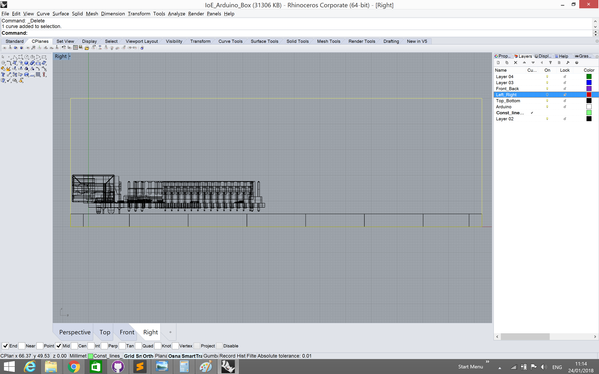

We're going to repeat the processes of the bottom side of the box. So draw a polyline that starts from the top left hand corner of the bottom extrusion. This polyline should have vertical segments of 50/5 long, and horizontal segments of 5mm.

So your polyline should look like this:

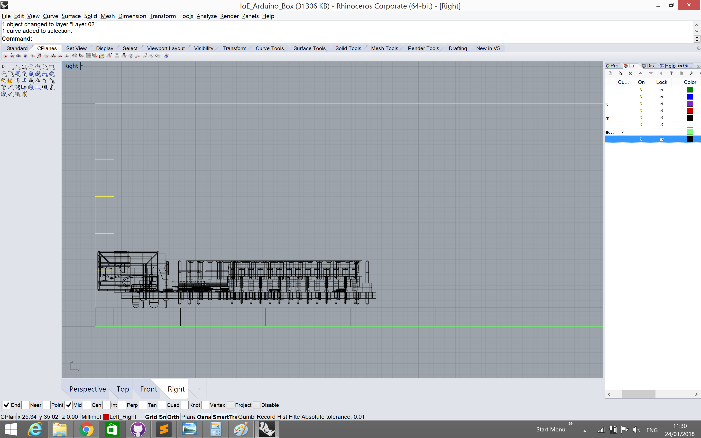

Then mirror using the midpoint of the horizontal rectangle lines.

Now draw the corresponding horizontal polyline, starting from the end of the vertical one. Remember the divisions? It should look like this:

OK now mirror the bottom polyline using the midpoint of the vertical rectangle line, and join all of those four new polylines together.

Now we can go back to 4 pane view and extrude this one by 5mm too! Is it extruding the right way? If not, try using -5mm instead...

Now mirror the entire bottom extrusion, using the midpoint of the mid point of the right extrusion as an axis. Now we have a lid.

And in the top view, you can mirror the right hand extrusion using the midpoint of the bottom extrusion as an axis. Now we have four sides!

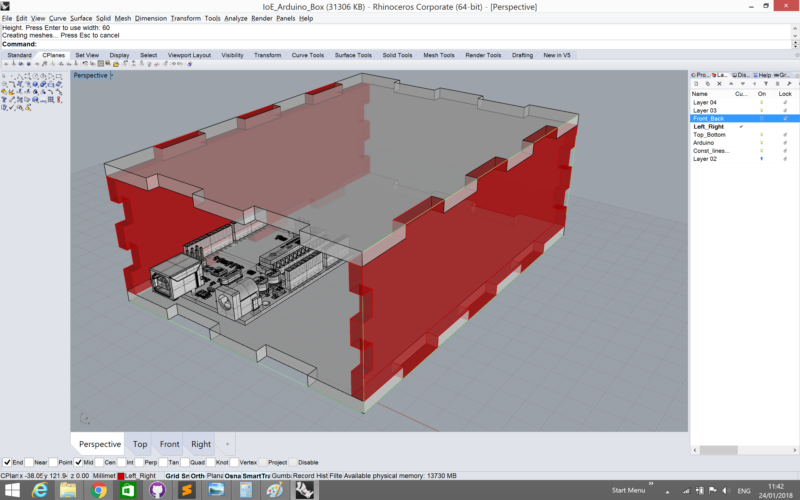

#### Third side of box

Now you may be thinking, jeez I have to do that all again for the front and back. But here's where it gets easier. On a new layer, all we now need to do is make a box that starts from the front bottom left hand corner of the the bottom extrusion (nearest the USB port of the Arduino). This box should be 120mm x 5mm x 60mm:

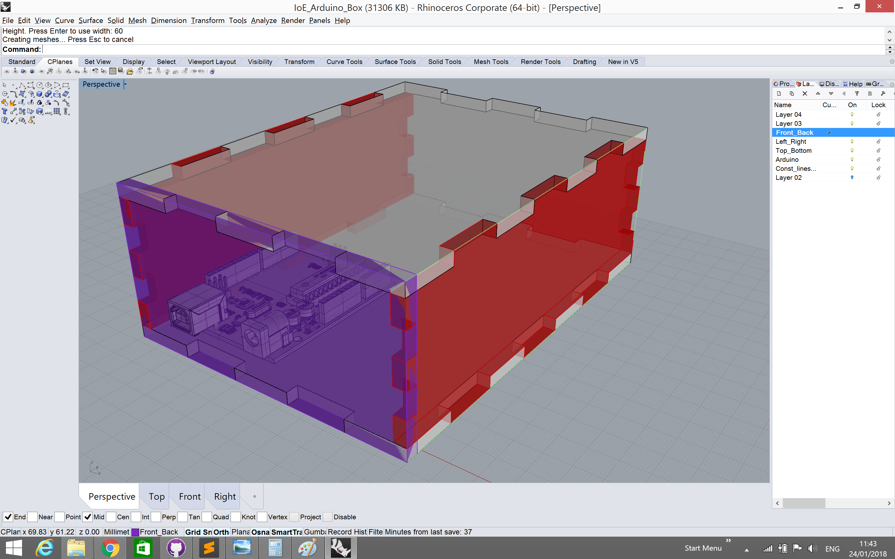

And we can use our old pal "Boolean Split" to chop out this final side using the other extrusions as cutting objects: 

- First select the front box
- Type "Boolean Split"
- Select all the other four extrusions as cutting objects 
- Hit enter

You may get a warning about tolerances here, but it will be fine in the real world.

Now you've split it, try turning off visibility on all other layers apart from the front one. You'll see, if you click around the edges, that there are now loads of offcuts. Just delete those.

Then go ahead and mirror the front so you get a back as well, and hey presto, you've made a box!

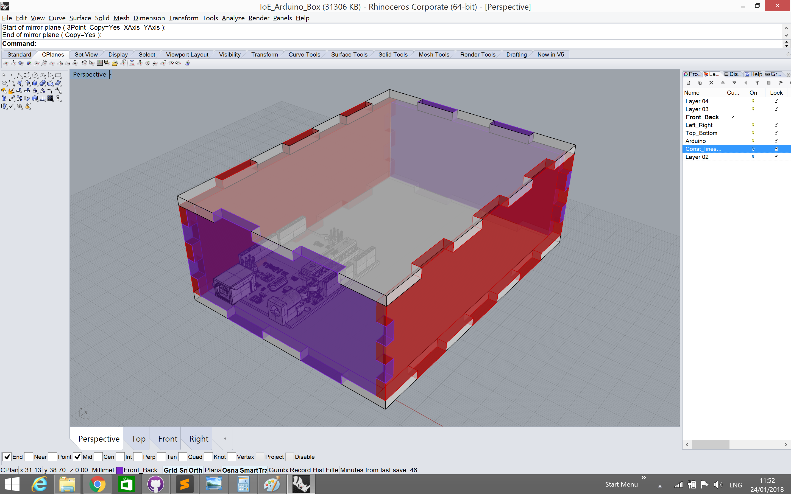

### Task 6 - Construction lines

### Task 7 - Cutting objects

### Task 8 - Adding screw and USB port holes

### Task 9 - Adding text to be engraved

### Task 10 - Adding ventilation holes

### Task 11 - Using Make2D to get surface outlines

### Task 12 - Arranging your 2D shapes for cutting

### Task 13 - Open Challenge: Add Handles

### Task 14 - Open Challenge: Add a lid

### Task 15 - Open Challenge: Add a pattern to be cut on one side

### Task 16 - Open Challenge: Add holes/mountings for buttons

http://www.instructables.com/id/Laser-Cut-Boxes/

https://grabcad.com/library/arduino-uno-r3-1

